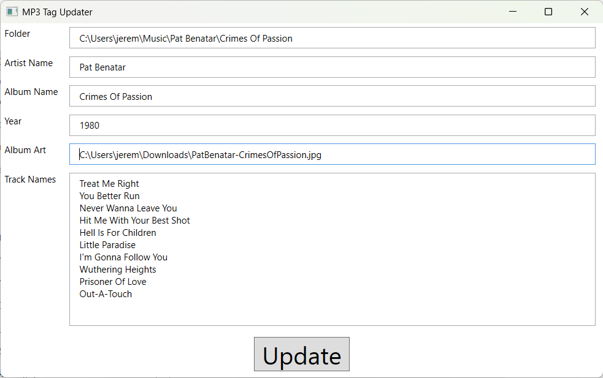

# mp3-tag-updater

Utility project mainly for me to add Album Artist and Album Art to existing MP3s. This is a WPF application written in C# 10 that runs on Windows only.  

TL;DR This does what I need it to do; it is not designed to be a general purpose tool.  

*Note: Since this is a quick utility, not much time has been spent on UI usability.*  

  

## Opening a Folder
Double-click inside the **Folder** text box to open a folder dialog. Select a folder for an MP3 album.  

The text boxes automatically populate based on existing MP3 tags.  

## Adding Album Art  

Double-click on the **Album Art** text box to open a file dialog. Select the image file to be used for cover art.  

## Update  

Click the **Update** button to update the files. A "Done" message will appear if the operation completed successfully.  

*Note: Because this is a quick utility, there is almost no error checking. For example, if you choose a folder that does not have any MP3 files, there may be an error. If an error occurs, the application will shut down. I have not used this enough yet to catch the potential errors. I will add error handling as I come across them.*

***